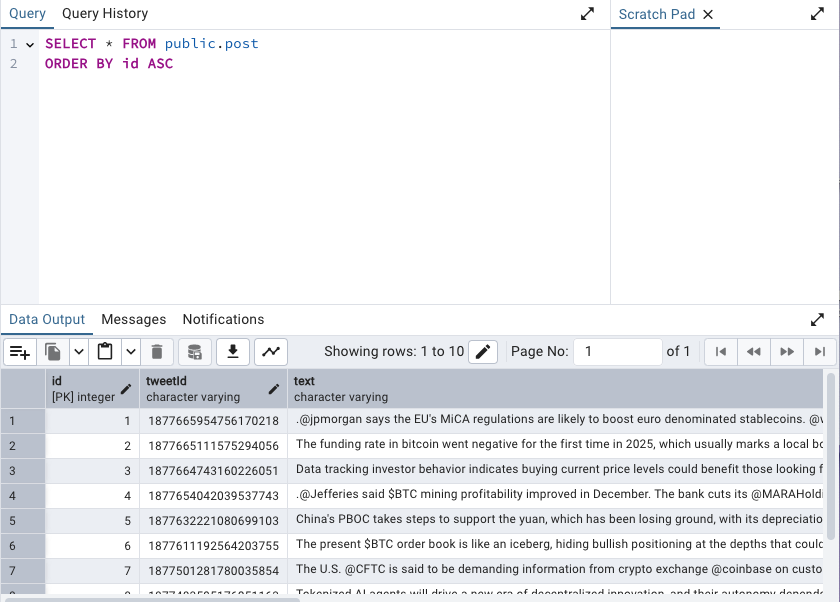

# Twitter Scraper Application

This is a NestJS-based application that scrapes Twitter data using the Twitter URL provided. It stores the scraped data in a PostgreSQL database and provides a simple API to interact with it.


<div align="center">
  
</div>

## Table of Contents

- [Prerequisites](#prerequisites)
- [Installation Steps](#installation-steps)
  - [Install Dependencies](#install-dependencies)
  - [Set Up PostgreSQL Database](#set-up-postgresql-database)
  - [Configure Environment Variables](#configure-environment-variables)
  - [Run the Application Locally](#run-the-application-locally)
  - [Deploy to Live Server](#deploy-to-live-server)
    - [Heroku](#deploying-to-heroku)
    - [Vercel](#deploying-to-vercel)
- [Database Structure](#database-structure)
- [Additional Configuration](#additional-configuration)

---

## Prerequisites

Before you start, ensure you have the following installed:

- **Node.js**: [Install Node.js](https://nodejs.org/en/)
- **npm**: npm is bundled with Node.js.
- **PostgreSQL**: [Install PostgreSQL](https://www.postgresql.org/download/) or ensure it’s running if you already have it.

---

## Installation Steps

### 1. Install Dependencies

After cloning the repository, you need to install the required npm dependencies:

```bash
# Clone the repository
git clone https://github.com/your-repo/twitter-scraper.git

# Navigate into the project directory
cd twitter-scraper

# Install dependencies
npm install
```

This will install all necessary packages, including NestJS, TypeORM, and the PostgreSQL driver.

### 2. Set Up PostgreSQL Database

Make sure PostgreSQL is installed and running on your local machine or remote server. If PostgreSQL is not installed, follow the installation instructions for your operating system:

- **Linux**: `sudo apt install postgresql`
- **Mac (Homebrew)**: `brew install postgresql`
- **Windows**: Follow the [PostgreSQL Windows installation guide](https://www.postgresql.org/download/windows/).

#### Create Database

Once PostgreSQL is installed, create the database where the scraper will store data:

```bash
# Connect to PostgreSQL
psql -h localhost -U postgres

# Create the database
CREATE DATABASE twitter_scraper;

# Exit PostgreSQL
\q
```

Ensure the database `twitter_scraper` exists before running the application.

### 3. Configure Environment Variables

Create a `.env` file in the root of your project to configure the environment variables. This file should contain the following configurations:

**.env**
```env
DATABASE_HOST=localhost
DATABASE_PORT=5432
DATABASE_USER=root
DATABASE_PASSWORD=
DATABASE_NAME=twitter_scraper
TWITTER_USERNAME=CoinDesk
EMAIL_HOST=smtp.example.com
EMAIL_PORT=587
EMAIL_USER=your_email@example.com
EMAIL_PASSWORD=your_password
CRON_SCHEDULE=0 * * * *  # Runs every hour
TWITTER_BEARER_TOKEN=
```

- `DATABASE_HOST`, `DATABASE_PORT`, `DATABASE_USER`, `DATABASE_PASSWORD`, `DATABASE_NAME`: These settings are used to connect to your PostgreSQL database.
- `TWITTER_USERNAME`: The Username of the Twitter account you want to scrape.
- `EMAIL_*`: Used for sending email notifications (if applicable).
- `CRON_SCHEDULE`: Defines the schedule for scraping (every hour in this example).

### 4. Run the Application Locally

#### Starting the Local Development Server

Once you've set up the environment variables and the database, you can start the application locally.

```bash
# Start the application
npm run start

# Or for development mode (auto-reloads when code changes)
npm run start:dev
```

The application will be available at `http://localhost:3000`.

#### Database Synchronization

The application uses **TypeORM** to connect to the PostgreSQL database. The `synchronize: true` option automatically synchronizes the database schema with your entities when the application starts. This will create the necessary tables (`Post` and `Image`) in the `twitter_scraper` database.

You can check if the tables have been created by logging into PostgreSQL:

```bash
psql -h localhost -U root -d twitter_scraper
```

Then, check the tables:

```sql
\dt
```

---

### 5. Deploy to Live Server

To deploy this application on a live server, you can use any cloud provider such as **Heroku**, **AWS EC2**, **DigitalOcean**, or **Vercel**.

#### Deploying to Heroku

1. **Install Heroku CLI**: Follow the [Heroku CLI installation guide](https://devcenter.heroku.com/articles/heroku-cli).
   
2. **Log in to Heroku**:

   ```bash
   heroku login
   ```

3. **Create a Heroku app**:

   ```bash
   heroku create twitter-scraper-app
   ```

4. **Set Up PostgreSQL on Heroku**:
   
   Add the Heroku PostgreSQL addon:

   ```bash
   heroku addons:create heroku-postgresql:hobby-dev
   ```

5. **Push the application to Heroku**:

   ```bash
   git push heroku main
   ```

6. **Configure Environment Variables on Heroku**:

   Set the environment variables on Heroku using the Heroku CLI:

   ```bash
   heroku config:set DATABASE_HOST=your_db_host
   heroku config:set DATABASE_PORT=5432
   heroku config:set DATABASE_USER=your_db_user
   heroku config:set DATABASE_PASSWORD=your_db_password
   heroku config:set DATABASE_NAME=your_db_name
   heroku config:set TWITTER_USERNAME=CoinDesk
   ```

7. **Access the application**: Once the application is deployed, you can access it via the Heroku-provided URL:

   ```bash
   heroku open
   ```

---

#### Deploying to Vercel

Vercel is another popular platform for deploying NestJS applications. Here's how to deploy it:

1. **Install Vercel CLI**: If you don't have it installed, run:

   ```bash
   npm i -g vercel
   ```

2. **Log in to Vercel**:

   ```bash
   vercel login
   ```

3. **Deploy the app**:

   Navigate to the root folder of your project and run the following command:

   ```bash
   vercel
   ```

   Follow the prompts to deploy your app. The process will take care of setting up the environment and generating a deployment URL.

4. **Set Up Environment Variables on Vercel**:

   After the app is deployed, configure the environment variables on the Vercel dashboard under your project settings.

---

## Database Structure

The application uses a PostgreSQL database to store the data.

### Entities

- **Post**: Stores scraped tweets.
  - `id`: Primary key (auto-increment).
  - `tweetText`: The text content of the tweet.
  - `createdAt`: Timestamp of when the tweet was scraped.

- **Image**: Stores images associated with the tweets.
  - `id`: Primary key (auto-increment).
  - `url`: URL of the image.

---

## Additional Configuration

### Email Configuration

If you want to enable email notifications, set up the SMTP server in the `.env` file with the appropriate values for:

- `EMAIL_HOST`
- `EMAIL_PORT`
- `EMAIL_USER`
- `EMAIL_PASSWORD`

### Does the Application Send Email When the Post Has Video?

No, the application does not currently send emails specifically when a tweet has a video. The email notifications are more general and can be configured to notify you about scraping activities, but it does not differentiate between tweets containing videos or not.

---

## Troubleshooting

- **Error: Unable to connect to the database.**  
  Ensure that PostgreSQL is running, and that the credentials in your `.env` file are correct.

- **Error: Synchronize failed.**  
  Double-check that the database exists (`twitter_scraper`) and that your user has the correct permissions to create tables.

---

### Pagination

If you would like to have pagination in api response update `src/twitter/twitter.controller.ts` and comment

```bash
const posts = await this.postRepository.find({ relations: ['images'] });
return { data: posts, total: posts.length };
```

Then uncomment this part

```bash
const [posts, count] = await this.postRepository.findAndCount({
   skip: (page - 1) * limit,
   take: limit,
   relations: ['images'],
});
return { data: posts, total: count };
```

Api URL for posts

```bash
http://localhost:3000/posts
```

with pagination

```bash
http://localhost:3000/posts?page=1
```

with limit

```bash
http://localhost:3000/posts?page=1&limit=10
```